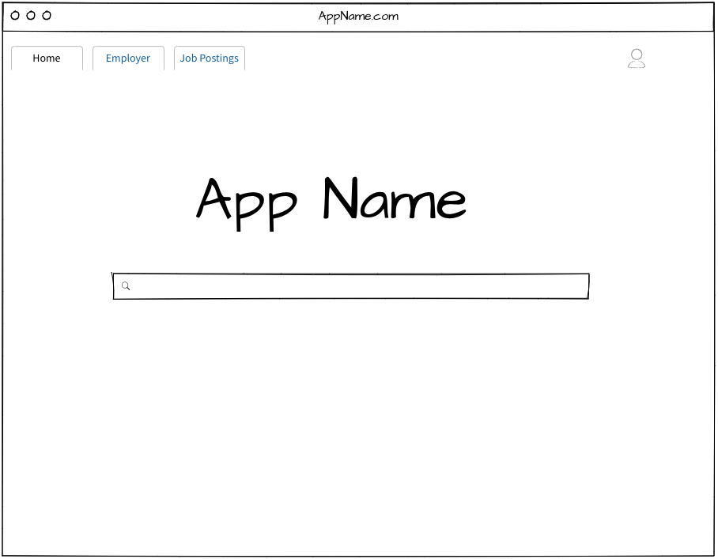
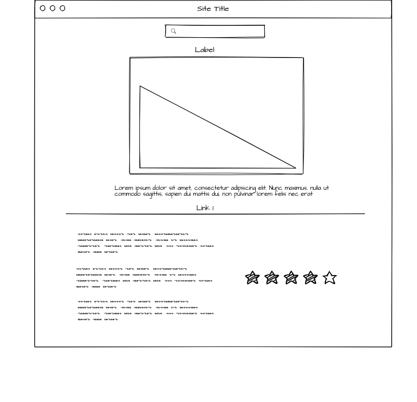
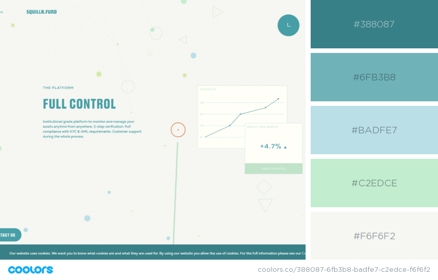

# Team Member Roles

### Ramon Garza - Database Management

### Ehson Raza - Project Management

### Tolu Alimi- Back-end Engineer

### Mina Ghaffar - UI/UX Designer

# UI/UX & User Flow

> - Welcome Page with Navbar
> - If users want to sign up so they can save searches there is a log in button
> - Search Bar where they can start searching for company by name
> - Once you click on a company name a sub menu will pop up with nav bar - info, history, financial info, graphs, etc.
> - Stretch Goal: filter by location and/or business category
> - Color Scheme: grey & blue & dark green & silver?

# Application Wire Frame

> ### Website Landing

> ### Results

> ### Company/Organization Page

## Theme

# Challenges

> ## Database

When estimating time and effort to allot to each user story, we allocated approximately 40% of our time to massaging the data and getting it into a workable state. However, what we didnt account for was the relative inexperince of the team while working distorted data tables. This lead to some spill over effects and the Database taking up 70% of team's capacity dedicated towards the project.

> ## Spillover Consequnces

Due to the challenges we faced with the database, the teams capacity and focus came under some strain, which lead to some downstream effects and some deadlines being missed related to: UI implementation for the company page, the news component and company card(housing data related to company culture) being in an unfinished state

# Remedies

> > The team plans on working to get the stated objectives accomplished through the weeks following 9/28/2020

# React.js App: StateVariable Flow

SearchForm component is appended to each page. App.js holds the searchData state variable. App.js also has the handleSearchResults function which sets searchData to the searchData parameter that is passed into it, and uses the history context to push that searchData state variable to the /results page. Now the App.js takes the handleSearchResults prop and drills it down to the SearchForm component where it is actually used. When the SearchForm is submitted, handleSearchResults is called and accepts the results of the API call as a parameter (searchData). HandleSearchResults takes the searchData parameter, assigns it to the searchData state variable in App.js, and we're back to the start of the explanation.
