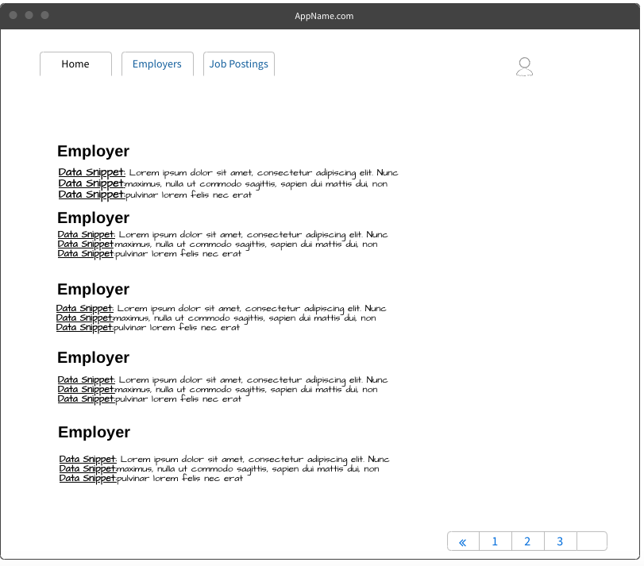

# Team Member Roles

| Name  | Role                |
| ----- | ------------------- |
| Ramon | Database Management |
| Ehson | Project Management  |
| Tolu  | Back-End Engineer   |
| Mina  | UI/UX Designer      |
|       |                     |

# Application Wire Frame

> ### <center>Website Landing


> ### <center>Results



> ### <center>Company/Organization Page


## <center>Theme


# Challenges

> ## <center>Database

When estimating time and effort to allot to each user story, we allocated approximately 40% of our time to massaging the data and getting it into a workable state. However, what we didnt account for was the relative inexperince of the team while working distorted data tables. This lead to some spill over effects and the Database taking up 70% of team's capacity dedicated towards the project.

> ## <center>Spillover Consequnces

Due to the challenges team faced with the database, the capacity and focus came under some strain, which lead to some downstream ripple effects and some deadlines being missed related to: UI implementation for the company page, the news component and company card(housing data related to company culture) being in an unfinished state

# Remedies

> The team plans on working to get the stated objectives accomplished through the weeks following 9/28/2020

# React.js App: StateVariable Flow

SearchForm component is appended to each page. App.js holds the searchData state variable. App.js also has the handleSearchResults function which sets searchData to the searchData parameter that is passed into it, and uses the history context to push that searchData state variable to the /results page. Now the App.js takes the handleSearchResults prop and drills it down to the SearchForm component where it is actually used. When the SearchForm is submitted, handleSearchResults is called and accepts the results of the API call as a parameter (searchData). HandleSearchResults takes the searchData parameter, assigns it to the searchData state variable in App.js, and we're back to the start of the explanation.

```JSX
 function App() {
const [searchData, setSearchData] = useState({});

const handleSearchResults = (searchData, history) => {
setSearchData(searchData);

    history.push("/results")
 return (
    <Router>
      <Route exact path="/">
        <Home handleSearchResults={handleSearchResults} />
      </Route>
      <Route exact path="/results">
        <Results
          handleSearchResults={handleSearchResults}
          searchData={searchData}
        />
      </Route>
      <Route exact path="/company/:ticker">
        <Company handleSearchResults={handleSearchResults} />
      </Route>
    </Router>
  );
}
}
```

> ## <center>Search Form

```JSX

function SearchForm({ handleSearchResults }) {
  const [search, setSearch] = useState("");
  const [searchData, setSearchData] = useState([]);
  const history = useHistory();

  const handleInputChange = (event) => {
    setSearch(event.target.value);
  };

  const handleFormSubmit = (event) => {
    event.preventDefault();

    // API call to populate Financial Information
    API.tickerSearch(search).then((results) => {
      if (results.length === 0) {
        throw new Error("No results found.");
      }

      const companyPromises = results.data.map((company) =>
        API.companyProfile(company.symbol)
      );
      Promise.all(companyPromises).then((companies) => {
        const companyList = companies
          .filter(newCompany => newCompany.data.length)
          .map((newCompany) => ({
            name: newCompany.data[0].companyName,
            symbol: newCompany.data[0].symbol,
            description: newCompany.data[0].description,
            industry: newCompany.data[0].industry,
            website: newCompany.data[0].website,
            sector: newCompany.data[0].sector,
            image: newCompany.data[0].image,
          }));

        setSearchData(companyList);

        handleSearchResults(companyList, history);
      });
    });
  };

```
